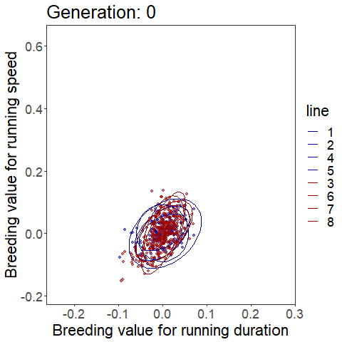

# QG-test-AP-hypothesis

## Overview of Repository

Version controlled and editable source for the data and code supporting the paper "How do trade-offs emerge? A test of the antagonistic pleiotropy hypothesis 
using a replicated artificial selection experiment" by Wilson, Wolak, Hiramatsu, Garland, & Careau.

For questions, please contact the corresponding author of the article:
Vincent Careau, University of Ottawa, vcareau@uottawa.ca

`R` code replicates the data preparation, statistical analyses, figure construction, and results reporting that were used in the above referenced manuscript.

## Data
To run the `R` code, you need the following files in the current working directory for your R session:
  - `QG-AP-test_data.txt`: contains all data necessary for the statistical analyses
  - `QG-AP-test_pedigree.txt`: contains the pedigree for the entire experiment

### `R` code overview
  - __Section 1__ make Figure 1
  
  - __Section 2__ make Figure 2
  
  - __Section 3A__ make the A-inverse to run animal models (requires pedigree and data files/objects)
    - saves data + A-inverses as `.RData` file
    
  - __Section 3B__ run `MCMCglmm` models
    - load `.RData` produced in __Section 3A__
    - check model output as shown in Table S1
    - saves `MCMCglmm` models as `.RData` file
    
  - __Section 3C__ extract genetic correlations
    - load `MCMCglmm` models produced in __Section 3B__
    - saves posteriors as `.RData` file
    
  - __Section 3D__ make Figure 3
    - requires posteriors with estimates for breeding values and genetic correlations
    
  - __Section 4__ make Figure 4
  
  - __Section 5__ make Figure S1
  
  - __Section 6__ make Table S1
  
  - __Section 7__ make Table S2

## Data citation
If you use the data or code, please cite as:

>TODO once get Zenodo doi

### Data metadata

Column headings for the datasets reflect variables defined and discussed in the main manuscript and supplementary materials. In brief, these are:

For the file "QG-AP-test_data.txt"
 - `animal` character values of the unique identity of each mouse
 - `GEN` integers denoting the generation of the experiment
 - `UNI` character values indicating the location of the experiment, either the University of Wisconsin-Madison ("WIS") or the University of California, Riverside ("UCR")
 - `Fcoeff` a numerical value indicating each individual's coefficient of inbreeding 
 - `sex` integer to indicate whether the mouse was a female (`0`) or male (`1`)
 - `damid` character value for the dam/mother
 - `sireid` character value for the sire/father
 - `line` integer value indicating which of the 8 replicate lines to which each mouse belonged
 - `linetype` integer indicating whether the mouse was from before selection began (`linetype = -1`) or, after selection began, from the lines designated as Control (`0`) or Selected for high voluntary wheel running behavior (`1`)
 - `WSTRTymd` character indicating the year, month, and day that marks the start of each mouse on wheels for 6 days 
 - `WHLSTAGE` integer that indicates <!-- TODO  -->
 - `RUN56` numeric value for the number of wheel revolutions run as an average of the values for days 5 and 6 (out of 6 days) 
 - `RPM56` numeric value for the average of day 5 and 6 values representing the average number of revolutions per minute recorded each day
 - `INT56` numeric value for the average of day 5 and 6 values representing the average duration, or number of intervals, in which a mouse was recorded as running each day
 - `RUN56l` numeric value for the natural log-transformed value of `RUN56` 
 - `RPM56l` numeric value for the natural log-transformed value of `RPM56`
 - `INT56l` numeric value for the natural log-transformed value of `INT56`
 - `pups` integer value of the total number of pups (offspring) produced by each individual. Mice not selected as breeders for the next generation were all assigned 0.
  

For the file "QG-AP-test_pedigree.txt"
 - `animal` character values of the unique identity of each mouse
 - `sire` character value for the sire/father
 - `dam` character value for the dam/mother
 - `GEN` integers denoting the generation of the experiment
 - `LINE` integer value indicating which of the 8 replicate lines to which each mouse belonged <!-- TODO: why value of 9  -->
 - `SEX` integer to indicate whether the mouse was a female (`0`) or male (`1`)
 - `Fcoeff` a numerical value indicating each individual's coefficient of inbreeding 
 - `ratio`<!-- TODO what is this  -->
 

## Changes
For ease of reference, an overview of significant changes to be noted below. Tag with commits or issues, where appropriate.
